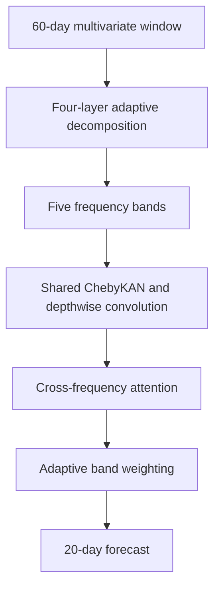

# TimeKAN: Adaptive Frequency-Decomposed KAN for Stock Forecasting

[](https://doi.org/10.1038/s41598-026-59107-4)
[](https://github.com/DrChenYou/Paper-3-TimeKAN-Stock-Forecasting/actions/workflows/ci.yml)


Research companion repository for:

> Jinfei Cao, Zheru Dong, Haoyi Xu, Xiaoou Liu, and You Chen. **TimeKAN: an adaptive frequency-decomposed Kolmogorov-Arnold network for long-term stock forecasting.** *Scientific Reports* (2026). https://doi.org/10.1038/s41598-026-59107-4

You Chen is the corresponding author of the associated article.

TimeKAN decomposes a multivariate stock sequence into adaptive frequency bands, processes every band with a shared multi-path Kolmogorov-Arnold block, and fuses the bands through cross-frequency attention and adaptive weighting.

## Architecture



### Paper configuration

| Parameter | Value |
| --- | ---: |
| Input length | 60 trading days |
| Forecast horizon | 20 trading days |
| Input variables | Open, Close, High, Low, Volume, Change |
| Decomposition layers | 4 |
| Frequency bands | 5 |
| Chebyshev order | 3 |
| Cross-frequency attention heads | 8 |
| Batch size | 32 |
| Learning rate | 0.001 |
| Scheduler | Cosine annealing to 0.000001 |
| Maximum epochs | 200 |
| Early-stopping patience | 20 |
| Dropout | 0.1 |
| Chronological split | 70% / 15% / 15% |

The paper does not specify the internal model width. `d_model: 64` in the configuration is an explicit implementation setting and can be changed without altering the documented decomposition depth, KAN order, or attention-head count.

### Published 20-day forecasting results

| Dataset | RMSE | MAE | MAPE | R-squared | Return |
| --- | ---: | ---: | ---: | ---: | ---: |
| AMZN | 16.45 | 11.28 | 0.85 | 94.72 | 498.36 |
| NVDA | 28.73 | 21.45 | 0.94 | 92.68 | 456.29 |
| TSLA | 35.42 | 27.86 | 1.18 | 91.25 | 423.58 |
| AAPL | 19.84 | 14.67 | 0.92 | 93.45 | 467.92 |

The article reports an average RMSE improvement of 21.5% relative to the strongest compared methods. It attributes 49.4% of the ablation improvement to M-KAN, 31.9% to the cascaded frequency decomposition, and 18.3% to the frequency-mixing block.

## Repository structure

```text
.
|-- configs/timekan.yaml       # Paper settings and declared implementation width
|-- scripts/train.py           # Chronological training and evaluation
|-- src/timekan/
|   |-- data.py                # CSV validation, scaling, and leak-free windows
|   |-- metrics.py             # RMSE, MAE, MAPE, and R-squared
|   `-- model.py               # CFD, ChebyKAN, M-KAN, and frequency mixer
|-- tests/                     # Shape, reconstruction, split, and metric tests
|-- DATASET.md                 # Sources, schema, and local layout
`-- MODEL_CARD.md              # Intended use and limitations
```

## Quick start

Using Conda:

```bash
conda env create -f environment.yml
conda activate timekan
```

Or using a Python virtual environment:

```bash
python -m venv .venv
source .venv/bin/activate
pip install -e ".[dev]"
pytest -q
```

Export a stock history as CSV, then train one asset at a time:

```bash
python scripts/train.py \
  --csv data/raw/AMZN.csv \
  --config configs/timekan.yaml \
  --output-dir runs/amzn
```

The CSV must be in ascending date order or contain a `Date` column that can be sorted. Required fields are `Open`, `Close`, `High`, `Low`, `Volume`, and `Change`. Details are in [DATASET.md](DATASET.md).

## Data processing

The scaler is fitted only on the first 70% of rows. Validation and test targets remain strictly inside their chronological partitions, while their input windows may use earlier observations as historical context. The default target is standardized `Close`; evaluation converts forecasts to the original price scale.

## Research-only use

This project evaluates a forecasting architecture. It does not provide personalized financial advice or an automated trading service. A backtest is sensitive to fees, slippage, data corrections, survivorship bias, and the chosen return rule, and does not establish future performance.

## Citation

```bibtex
@article{cao2026timekan,
  author  = {Cao, Jinfei and Dong, Zheru and Xu, Haoyi and Liu, Xiaoou and Chen, You},
  title   = {TimeKAN: an adaptive frequency-decomposed Kolmogorov-Arnold network for long-term stock forecasting},
  journal = {Scientific Reports},
  year    = {2026},
  doi     = {10.1038/s41598-026-59107-4}
}
```

## License

Repository code is released under the [MIT License](LICENSE). Market data and the article retain their respective terms and licences.
